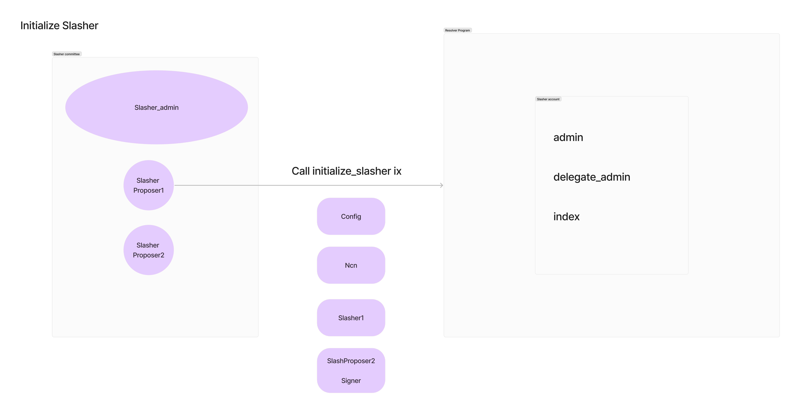
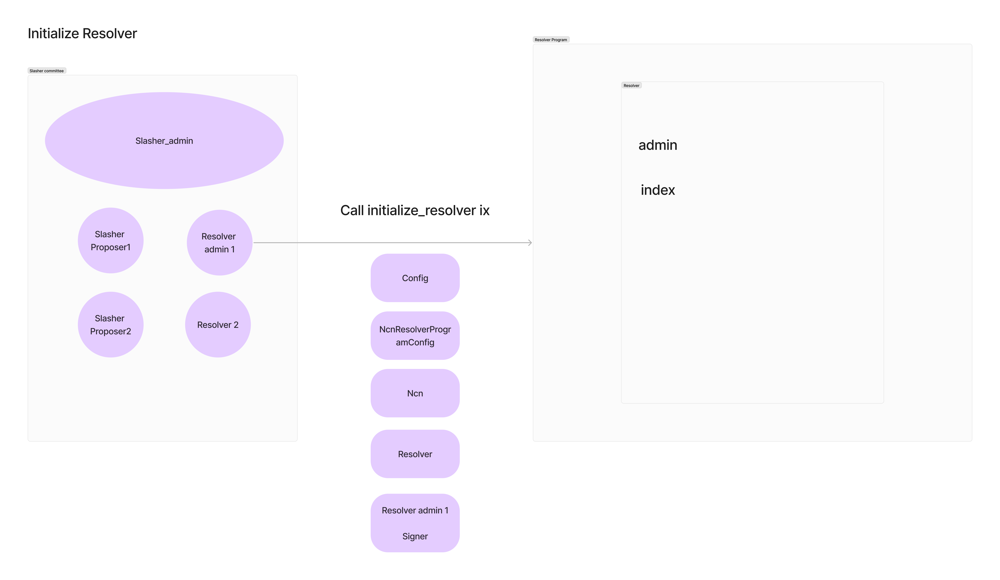
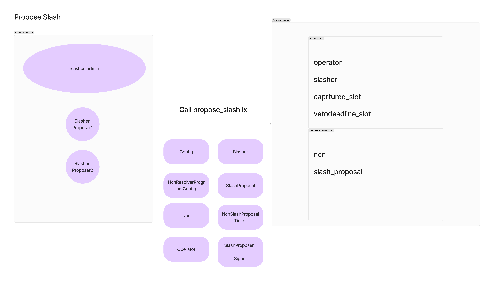
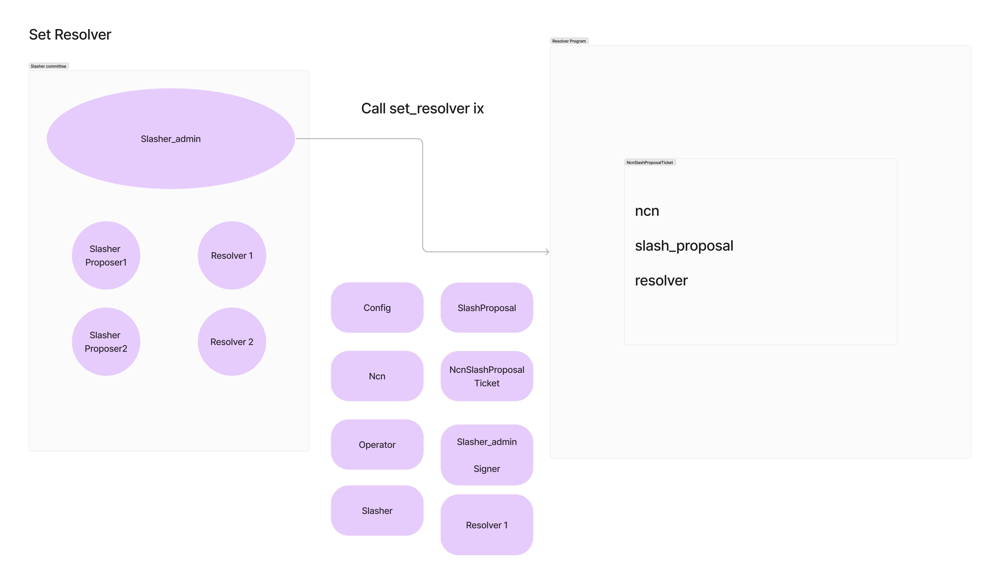

# Slashing managers and arbitration systems

## Overview

Resolvers are program that is able to veto slashing incidents forwarded from networks and can be shared across networks.

1. Handling Slashing Incidents

2. Veto Power

3. Creating a Layer of Security and Fairness

## Role

### Resolver

The resolver is typically responsible for evaluating disputes or conditions and deciding on the next action in the protocol. In the context of a restaking protocol, the resolver could be seen as a "judge" or decision-maker that:

1. Receives a slashing request: 
- When someone (the proposer) requests that a validator or operator should be slashed (penalized for bad behavior), this request is passed to the resolver.

2. Evaluates the evidence: 
- The resolver examines the conditions surrounding the slashing request. This could involve checking whether the validator failed to meet certain criteria, violated the protocol’s rules, or engaged in malicious activity.

3. Makes a decision: After reviewing the evidence or inputs, the resolver decides whether to:
- Execute the slash: If the conditions are met, the resolver instructs the protocol to penalize the validator (e.g., by reducing their stake, burning tokens, etc.).
- Veto the slash: If the conditions aren't met or the slash request is deemed invalid, the resolver can reject the request.

In essence, the resolver acts as the decision-making mechanism that ensures slashing occurs under the right circumstances, preventing arbitrary or malicious slashing requests.

### Slasher

The slasher is the entity that carries out the action of slashing when instructed. Once the resolver has made its decision, the slasher's role is straightforward:

1. Enforces the slashing:
If the resolver approves the slash, the slasher enforces it by penalizing the offending participant (e.g., taking away their stake, reducing rewards, etc.).

2. No decision-making:
The slasher does not decide whether a slash should happen—it only performs the action of slashing based on the resolver’s decision.

## Flow

1. Initialize a Slasher



2. Initialize a Resolver



3. Propose a slash



4. Set the resolver



5. Veto the Slash

6. Execute the Slash

## Getting started

### Build
Build the program: 
```bash
cargo-build-sbf
```

### Test
```bash
cargo nextest run --all-features
```

## Resources
- https://github.com/jito-foundation/stakenet
- https://build.superteam.fun/ideas/ideas-to-build-on-jito-stakenet
